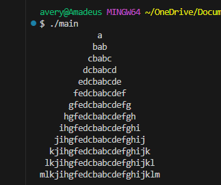

# cPlusPlusHTP_18.25

Write a program that generates the following from the string "abcdefghijklmnopqrstuvwxyz":

            a
           bcb
          cdedc
         defgfed
        efghihgfe
       fghijkjihgf
      ghijklmmlkjihg
     hijklmnonnmlkjih
    ijklmnopqponmlkji
   jklmnopqrstsrqponmlkj
  klmnopqrstuvutsrqponmlk
 lmnopqrstuvwvvutsrqponml
mnopqrstuvwxyxwvutsrqponm
nopqrstuvwxyzzyxwvutsrqpon

# commands
compile
g++ main.cpp -o main -static

run
./main
